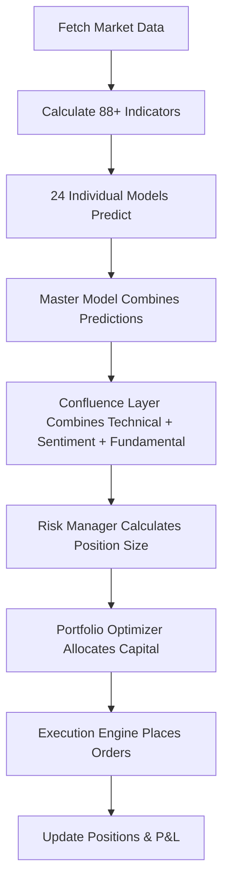

# Nova Aetus - Complete User Guide

## Table of Contents

1. [System Overview](#system-overview)
2. [System Structure](#system-structure)
3. [Commands & Operations](#commands--operations)
4. [Tech Stack](#tech-stack)
5. [Configuration](#configuration)
6. [Troubleshooting](#troubleshooting)
7. [Critical Concepts](#critical-concepts)

---

## System Overview

### What Is Nova Aetus?

Nova Aetus is an automated trading system that uses AI to analyze stocks and execute trades. It combines multiple factors to make trading decisions:

- **Technical Analysis** (88+ indicators)
- **Machine Learning** (XGBoost models)
- **Sentiment Analysis** (news/social media via local LLM)
- **Fundamental Analysis** (company financials)

When these factors agree, the system generates a trading signal and executes trades via Alpaca API.

### Two-Layer Model Architecture

The system uses a hierarchical model architecture inspired by Renaissance Technologies:

**Layer 1: Individual Stock Models (24 models)**
- One XGBoost model per stock (AAPL, MSFT, GOOGL, etc.)
- Trained on historical data for that specific stock
- Predicts if stock will go up or down
- Files: `models/{SYMBOL}_{DATE}.json`

**Layer 2: Master Ensemble Model (1 unified model)**
- Combines predictions from all 24 individual models
- Learns cross-symbol patterns (e.g., tech sector correlations)
- Adapts weights based on market conditions
- Outputs improved predictions
- File: `models/master_model_{DATE}.json`

### Trading Flow



**What Happens:**
1. **Data Collection**: Fetches latest prices, volume for all symbols
2. **Feature Engineering**: Calculates 88+ technical indicators
3. **Individual Models**: Each symbol model predicts direction
4. **Master Model**: Combines all predictions, learns cross-symbol patterns
5. **Confluence Layer**: Combines Technical + Sentiment + Fundamental signals
6. **Risk Management**: Calculates position size using Kelly Criterion
7. **Portfolio Optimization**: Allocates capital across positions
8. **Execution**: Places buy/sell orders via Alpaca API

---

## System Structure

### Black Box Breakdown

**Data Pipeline**
- **DataLoader**: Fetches historical/real-time data from Alpaca API (with yahooquery fallback)
- **StorageService**: Manages TimescaleDB with continuous aggregates (1m, 1h, 1d), compression
- **Database**: TimescaleDB (PostgreSQL time-series extension) stores all market data, signals, positions

**Feature Engine**
- **TechnicalFeatures**: Calculates 88+ indicators (RSI, MACD, Bollinger Bands, ADX, etc.)
- **Fractional Differencing**: Maintains stationarity without losing price memory
- **Z-Score Normalization**: Standardizes features for model input
- **Feature Selection**: Research-backed prioritization (Squeeze_pro, PPO, MACD, ROC63, RSI63)

**ML Pipeline**
- **Individual Models**: 24 XGBoost models (one per symbol)
- **Master Ensemble Model**: Meta-model that learns to combine individual predictions
- **NPMM Labeling**: N-Period Min-Max labeling for high-confidence swing points
- **GPU Acceleration**: RTX 5070 Ti optimized training with QuantileDMatrix

**Confluence Layer**
- **Multi-Signal Combination**: Combines Technical + Sentiment + Fundamental signals
- **Regime-Aware Weighting**: Adjusts signal weights based on market conditions (trending, volatile, mean-reverting)
- **Confidence Calibration**: Normalizes signals for comparable scores

**Risk Management**
- **RiskManager**: Kelly Criterion position sizing, circuit breakers, drawdown protection
- **Kelly Criterion**: Optimal position sizing based on win rates and payoff ratios (fractional Kelly for safety)
- **Circuit Breakers**: Multi-level protection (WARN → SOFT_HALT → HARD_HALT) when errors occur
- **Drawdown Protection**: Halts trading if drawdown exceeds threshold (default: 10%)
- **ATR-Based Stop Loss**: Dynamic stop-loss levels based on volatility

**Portfolio Optimization**
- **PortfolioOptimizer**: Allocates capital across multiple positions
- **Optimization Methods**:
  - Mean-Variance (maximizes Sharpe ratio)
  - Risk Parity (equal risk contribution)
  - Hierarchical Risk Parity (HRP) - clustering-based allocation
  - Kelly Criterion (optimal growth)
  - Minimum Variance (minimizes risk)
  - Equal Weight (simple 1/n allocation)
- **Correlation-Aware**: Considers correlations between positions
- **Constraints**: Max position size (default: 20%), long-only support

**Execution Engine**
- **ExecutionEngine**: Places orders via Alpaca Trading API
- **Order Management**: Market orders, limit orders, stop-loss orders
- **Position Tracking**: Monitors open positions, P&L
- **Cost Modeling**: Estimates execution costs

**Model Registry**
- **ModelRegistry**: Manages all trained models (individual + master)
- **Version Management**: Loads latest models automatically
- **On-Demand Loading**: Models loaded when needed during trading
- **Caching**: Keeps models in memory to reduce I/O

**Sentiment Analyzer**
- **SentimentAnalyzer**: Analyzes news/social media using Ollama (local LLM)
- **Privacy-Preserving**: No data sent to external APIs
- **Multi-Source**: News, social media (StockTwits), earnings
- **Confidence Aggregation**: Combines sentiment from multiple sources

### Project Structure

```
nova_aetus/
├── .env                    # API keys (create from .env.example)
├── config.toml             # Strategy parameters
├── docker-compose.yml      # Database setup
├── requirements.txt        # Python dependencies
├── train                   # Training command script (use: ./train)
├── models/                 # Trained models (individual + master)
│   ├── AAPL_20250117.json
│   ├── MSFT_20250117.json
│   └── master_model_20250117.json
├── logs/                   # Application logs
├── mcp_server/             # MCP integration for Cursor IDE
└── src/nova/
    ├── main.py             # Main trading loop
    ├── core/               # Config, logging, notifications, health
    ├── data/               # DataLoader, StorageService
    ├── features/           # TechnicalFeatures, SentimentAnalyzer
    ├── models/             # ModelTrainer, ModelRegistry, MasterEnsembleModel
    ├── strategy/           # ConfluenceLayer, RiskManager, PortfolioOptimizer, ExecutionEngine
    └── dashboard/          # Streamlit dashboard
```

### File Locations

- **Models**: `models/{SYMBOL}_{DATE}.json` (individual), `models/master_model_{DATE}.json` (master)
- **Logs**: `logs/nova_aetus_{DATE}.log`
- **Configuration**: `config.toml` (strategy), `.env` (API keys)
- **Database**: TimescaleDB in Docker (default: `localhost:5432`)

---

## Commands & Operations

### Training Commands

Use the `./train` script for all training operations:

**Train All Individual Models**
```bash
# Default: 3 years of data
./train all

# Custom years
./train all 5
```

**Train Master Ensemble Model**
```bash
# Default: 2 years of data
./train master

# Custom years
./train master 3
```

**Prerequisites**: Individual models must be trained first!

**Train Specific Symbols**
```bash
# Default: 3 years
./train AAPL MSFT GOOGL

# Custom years
./train AAPL MSFT 5
```

**Training Times** (with RTX 5070 Ti GPU):
- Single symbol: ~10-30 minutes
- All 24 symbols: ~4-12 hours
- Master model: ~5-15 minutes

### Running the System

**Start Database**
```bash
docker-compose up -d
```

**Start Trading Loop**
```bash
python -m src.nova.main
```

The trading loop:
1. Loads all trained models (individual + master)
2. Fetches latest market data every minute
3. Generates predictions from all models
4. Master model improves predictions
5. Confluence layer combines signals
6. Risk manager calculates position sizes
7. Portfolio optimizer allocates capital
8. Execution engine places orders
9. Sends Discord notifications

**Start Dashboard**
```bash
streamlit run src/nova/dashboard/app.py
```

Dashboard shows:
- Current positions and P&L
- Performance metrics
- Trading signals
- Model predictions
- System health

### Common Tasks

**Check System Status**
```bash
# View logs
tail -f logs/nova_aetus_*.log

# Check database connection
docker exec -it timescaledb psql -U nova_user -d nova_aetus
```

**Verify Models**
```bash
# List trained models
ls -lh models/*.json

# Check model count (should have 24 individual + 1 master)
ls models/*.json | wc -l
```

**Monitor GPU Usage** (during training)
```bash
watch -n 1 nvidia-smi
```

**Stop Services**
```bash
# Stop trading loop: Ctrl+C

# Stop database
docker-compose down
```

---

## Tech Stack

### Libraries & Frameworks

**Core Technologies**
- **Python 3.12+**: Primary language
- **Polars**: Rust-based DataFrame (10-100x faster than Pandas)
- **Pydantic**: Runtime type validation and data modeling

**Machine Learning**
- **XGBoost 2.0+**: Gradient boosting (GPU-enabled)
- **Optuna 3.0+**: Hyperparameter optimization
- **scikit-learn 1.3+**: Preprocessing, metrics, cross-validation
- **SHAP**: Model interpretability and feature importance

**Database & Storage**
- **TimescaleDB**: PostgreSQL time-series extension
- **asyncpg**: High-performance async PostgreSQL driver
- **Continuous Aggregates**: Pre-computed 1m, 1h, 1d rollups
- **Hypercompression**: 90x storage reduction

**Data Sources**
- **alpaca-py**: Alpaca Pro API client (primary data source)
- **yahooquery**: Yahoo Finance fallback (free, no API keys)

**Sentiment Analysis**
- **ollama**: Local LLM inference server
- **Models**: Llama-3, Mistral (run locally, no API costs)

**Dashboard & Visualization**
- **Streamlit**: Web dashboard
- **Plotly**: Interactive charts

**Performance Analytics**
- **quantstats**: Professional portfolio analytics, performance metrics, tearsheets

### System Components

**Portfolio Optimizer**
- **Methods**: Mean-Variance, Risk Parity, Hierarchical Risk Parity (HRP), Kelly Criterion, Minimum Variance, Equal Weight
- **Features**: Correlation-aware position sizing, configurable max position weights (default: 20%), long-only constraint support
- **Implementation**: `src/nova/strategy/portfolio_optimizer.py`
- **Default Method**: Mean-Variance (maximizes Sharpe ratio)

**Risk Manager**
- **Kelly Criterion**: Optimal position sizing based on win rates and payoff ratios (fractional Kelly: 25-50% for safety)
- **Circuit Breakers**: Multi-level protection (WARN → SOFT_HALT → HARD_HALT) when >5 errors in 1 minute
- **Drawdown Protection**: Halts trading if drawdown >10% (configurable)
- **ATR-Based Stop Loss**: Dynamic stop-loss levels (default: 2x ATR)
- **Trailing Stops**: 5% trailing stop distance (configurable)
- **Implementation**: `src/nova/strategy/risk.py`

**Confluence Layer**
- **Multi-Signal Combination**: Combines Technical (40%), Sentiment (35%), Fundamental (25%) signals
- **Regime-Aware Weighting**: Adjusts weights based on market conditions (bullish, bearish, high volatility, trending, mean-reverting)
- **Confidence Calibration**: Normalizes signals for comparable scores
- **Z-Score Normalization**: Ensures signals are comparable across different scales
- **Implementation**: `src/nova/strategy/confluence.py`

**Execution Engine**
- **Alpaca API Integration**: Places orders via Alpaca Trading API
- **Order Types**: Market orders, limit orders, stop-loss orders
- **Position Tracking**: Monitors open positions, P&L in real-time
- **Cost Modeling**: Estimates execution costs (commissions, slippage)
- **Implementation**: `src/nova/strategy/execution.py`

**Model Registry**
- **Symbol-Specific Loading**: Each symbol uses its own trained model
- **Version Management**: Automatically loads latest models
- **On-Demand Loading**: Models loaded when needed (not all at startup)
- **Caching**: Keeps models in memory to reduce file I/O
- **Master Model Support**: Loads master ensemble model if available
- **Implementation**: `src/nova/models/predictor.py`

**Technical Features**
- **88+ Indicators**: RSI, MACD, Bollinger Bands, ADX, Stochastic, CCI, OBV, ATR, SMA, EMA, and more
- **Fractional Differencing**: Maintains stationarity without losing price memory (Lopez de Prado method)
- **Z-Score Normalization**: Standardizes features for model input
- **Research-Backed Selection**: Prioritizes top indicators (Squeeze_pro, PPO, MACD, ROC63, RSI63)
- **Implementation**: `src/nova/features/technical.py`

**Sentiment Analyzer**
- **Local LLM**: Uses Ollama for privacy-preserving sentiment analysis
- **Multi-Source**: News, social media (StockTwits), earnings
- **FinGPT-Style Prompts**: Financial domain-specific prompts
- **Confidence Aggregation**: Combines sentiment from multiple sources with weighted averages
- **Implementation**: `src/nova/features/sentiment.py`

**Data Pipeline**
- **DataLoader**: Async fetching from Alpaca API (with yahooquery fallback)
- **StorageService**: TimescaleDB management, continuous aggregates, compression
- **Caching**: Database-first caching (70-80% faster subsequent training runs)
- **Real-Time Aggregates**: Combines materialized + recent data for fast queries
- **Implementation**: `src/nova/data/loader.py`, `src/nova/data/storage.py`

### Hardware Optimizations

**RTX 5070 Ti GPU**
- **XGBoost Training**: GPU acceleration (10-100x faster than CPU)
- **QuantileDMatrix**: 5x memory reduction vs standard DMatrix
- **RAPIDS Memory Manager**: Faster GPU memory allocation
- **Gradient Sampling**: Additional 20-30% memory savings (XGBoost 3.0+)

**Ollama Inference**
- **Local LLM**: Runs on GPU for fast sentiment analysis
- **No API Costs**: All inference happens locally
- **Privacy**: No data sent to external services

---

## Configuration

### Environment Variables (`.env`)

Create `.env` from `.env.example`:

```bash
# Alpaca Trading API (required for trading)
ALPACA_API_KEY=your_api_key_here
ALPACA_SECRET_KEY=your_secret_key_here

# Discord Webhook (for notifications)
DISCORD_WEBHOOK_URL=https://discord.com/api/webhooks/...

# Database (defaults work for Docker)
DB_HOST=localhost
DB_PORT=5432
DB_NAME=nova_aetus
DB_USER=nova_user
DB_PASSWORD=your_password
```

**Required**: Alpaca API keys for trading
**Optional**: Discord webhook for notifications, database credentials (Docker defaults usually work)

### Strategy Settings (`config.toml`)

**Technical Indicators**
```toml
[technical]
rsi_period = 14
macd_fast = 12
macd_slow = 26
bollinger_period = 20
atr_period = 14
sma_short = 20
sma_long = 50
```

**ML Model Parameters**
```toml
[ml]
n_estimators = 100
max_depth = 6
learning_rate = 0.1
optuna_trials = 100
use_quantile_dmatrix = true  # GPU memory optimization
use_rmm = true               # Faster GPU allocation
```

**Risk Management**
```toml
[risk]
max_position_size_pct = 0.10      # 10% max per position
risk_per_trade_pct = 0.02         # 2% risk per trade
max_portfolio_risk_pct = 0.20     # 20% total portfolio risk
atr_stop_multiplier = 2.0         # Stop loss at 2x ATR
max_drawdown_pct = 0.10           # Halt if drawdown >10%
```

**Circuit Breakers**
```toml
[circuit_breaker]
max_errors_per_minute = 5
error_window_seconds = 60
halt_on_breach = true
```

**Symbol List**
```toml
[data]
symbols = ["AAPL", "MSFT", "GOOGL", "AMZN", "NVDA", ...]  # 24 symbols
default_timeframe = "1Day"
```

**Sentiment Analysis**
```toml
[sentiment]
model_name = "llama3"      # or "mistral"
temperature = 0.7
max_tokens = 512
```

### Adding/Removing Symbols

Edit `config.toml`:
```toml
[data]
symbols = ["AAPL", "MSFT", "NEW_SYMBOL"]  # Add NEW_SYMBOL
```

Then retrain models:
```bash
./train NEW_SYMBOL  # Train just the new symbol
# or
./train all         # Retrain all symbols
```

---

## Troubleshooting

### Common Issues

**"No models found"**
- **Cause**: Individual models not trained yet
- **Fix**: Train individual models first:
  ```bash
  ./train all
  ```

**"Database connection failed"**
- **Cause**: TimescaleDB not running
- **Fix**: Start database:
  ```bash
  docker-compose up -d
  ```
- **Verify**: `docker ps` should show `timescaledb` container running

**"CUDA out of memory"**
- **Cause**: GPU memory exhausted during training
- **Fix**:
  - Enable QuantileDMatrix (already enabled by default)
  - Enable feature selection: `feature_selection_top_n = 30` in `config.toml`
  - Reduce years of data: `./train all 2` instead of `./train all 5`
  - Train one symbol at a time: `./train AAPL`

**"Ollama model not found"**
- **Cause**: Ollama model not downloaded
- **Fix**: Pull the model:
  ```bash
  ollama pull llama3
  # or
  ollama pull mistral
  ```

**"Training too slow"**
- **Cause**: GPU not being used or not available
- **Fix**:
  - Verify GPU: `nvidia-smi` should show GPU activity
  - Check logs for "Training XGBoost model on GPU" message
  - Ensure CUDA installed: `python -c "import xgboost; print(xgboost.__version__)"`
  - Check `config.toml`: `use_quantile_dmatrix = true`, `use_rmm = true`

**"Master model training failed: No individual models found"**
- **Cause**: Individual models not trained before training master
- **Fix**: Train individual models first:
  ```bash
  ./train all      # Train individual models first
  ./train master   # Then train master model
  ```

**"Alpaca API error"**
- **Cause**: Invalid API keys or rate limits
- **Fix**:
  - Verify API keys in `.env`
  - Check account status (not blocked, has buying power)
  - Ensure market is open (for market orders)
  - Wait if rate limited (Alpaca has request limits)

**"Circuit breaker triggered: Trading halted"**
- **Cause**: Too many errors (>5 in 1 minute)
- **Fix**:
  - Check error logs: `tail -f logs/nova_aetus_*.log`
  - Fix underlying issue (API, database, etc.)
  - Circuit breaker resets after errors subside

### Debugging Tips

**View Logs**
```bash
# Follow logs in real-time
tail -f logs/nova_aetus_*.log

# Search for errors
grep ERROR logs/nova_aetus_*.log

# Last 100 lines
tail -n 100 logs/nova_aetus_*.log
```

**Check Model Files**
```bash
# List all models
ls -lh models/*.json

# Check model count (should have 25: 24 individual + 1 master)
ls models/*.json | wc -l

# Verify model metadata
cat models/AAPL_*.metadata.json
```

**Verify Database**
```bash
# Connect to database
docker exec -it timescaledb psql -U nova_user -d nova_aetus

# Check tables
\dt

# Check data
SELECT COUNT(*) FROM ohlcv_daily;
```

**Monitor GPU Usage**
```bash
# Watch GPU during training
watch -n 1 nvidia-smi

# Should show:
# - GPU utilization: 80-100%
# - Memory usage: <14GB (with QuantileDMatrix)
# - Temperature: <85°C
```

**Test Individual Components**
```bash
# Test Alpaca connection
python scripts/test_alpaca_connection.py

# Test database connection
docker exec -it timescaledb psql -U nova_user -d nova_aetus -c "SELECT 1;"

# Test Ollama
ollama list
```

### Performance Issues

**Training Too Slow**
- Verify GPU usage: `nvidia-smi` during training
- Enable optimizations: `use_quantile_dmatrix = true`, `use_rmm = true` in `config.toml`
- Reduce Optuna trials: `optuna_trials = 50` (default: 100)
- Use feature selection: `feature_selection_top_n = 30`

**Trading Loop Too Slow**
- Check database queries (should use continuous aggregates)
- Verify model caching (models loaded once, reused)
- Monitor API rate limits (Alpaca has limits)

**High Memory Usage**
- Enable QuantileDMatrix (already default)
- Enable gradient sampling (XGBoost 3.0+)
- Reduce feature count: `feature_selection_top_n = 30`
- Use CPU mode if GPU memory insufficient: Set `device="cpu"` in `config.toml`

---

## Critical Concepts

### Model Architecture

**Individual Models**
- One XGBoost model per stock symbol
- Trained on historical data for that specific stock
- Predicts binary outcome: price goes up (1) or down (0)
- Uses 88+ technical indicators as features
- NPMM labeling for high-confidence swing points

**Master Ensemble Model**
- Meta-model that learns to combine all individual predictions
- Takes 66 meta-features:
  - Individual predictions (24 features)
  - Individual confidences (24 features)
  - Cross-symbol statistics (6 features)
  - Sector correlations (8 features)
  - Market regime (4 features)
- Outputs improved prediction score per symbol
- Learns cross-symbol patterns (e.g., tech sector moves together)

### Signal Confluence

**Three Signal Types**
1. **Technical** (40% weight): ML model predictions, technical indicators
2. **Sentiment** (35% weight): News, social media, earnings sentiment
3. **Fundamental** (25% weight): Company financials (P/E, ROE, debt)

**Regime-Aware Weighting**
Weights adjust based on market conditions:
- **Bullish Market**: Sentiment weight increases (40%), Technical decreases (35%)
- **Bearish Market**: Fundamental weight increases (40%), others decrease
- **High Volatility**: Technical weight increases (50%), others decrease
- **Trending Market**: Technical weight increases (50%)

**Combination Formula**
```
Confluence Score = (Technical × w_tech) + (Sentiment × w_sent) + (Fundamental × w_fund)
```

### Risk Management

**Kelly Criterion**
- Optimal position sizing based on win probability and payoff ratio
- Formula: `f* = (p × b - q) / b` where:
  - `p` = win probability (from model)
  - `b` = payoff ratio (avg win / avg loss)
  - `q` = loss probability (1 - p)
- Fractional Kelly (25-50%) used for safety against estimation error

**Circuit Breakers**
- Multi-level protection system:
  - **WARN**: Logs warning when errors detected
  - **SOFT_HALT**: Stops new trades, closes existing positions
  - **HARD_HALT**: Completely halts system
- Triggered when >5 errors occur in 1 minute

**Drawdown Protection**
- Tracks peak equity over time
- Drawdown = `(peak_equity - current_equity) / peak_equity`
- Halts trading if drawdown >10% (configurable)

**Stop Loss**
- ATR-based: `stop_loss = entry_price ± (ATR × 2.0)`
- Trailing stop: Follows price up, locks in profits
- Trailing distance: 5% (configurable)

### Portfolio Optimization

**Optimization Methods**
1. **Mean-Variance**: Maximizes Sharpe ratio (risk-adjusted return)
2. **Risk Parity**: Equal risk contribution per position
3. **Hierarchical Risk Parity (HRP)**: Clustering-based allocation (robust to estimation errors)
4. **Kelly Criterion**: Optimal growth portfolio
5. **Minimum Variance**: Minimizes portfolio risk
6. **Equal Weight**: Simple 1/n allocation

**Constraints**
- Max position size: 20% per position (configurable)
- Long-only: No shorting (configurable)
- Correlation-aware: Considers correlations between positions

### Training Workflow

**Typical Workflow**
1. Train individual models: `./train all`
2. Train master model: `./train master`
3. Run trading loop: `python -m src.nova.main`

**Retraining Schedule**
- **Individual models**: Monthly or when performance degrades
- **Master model**: Quarterly or when adding new symbols

**Model Validation**
- Walk-forward validation: Prevents overfitting
- Deflated Sharpe Ratio (DSR): Accounts for multiple trials
- Probability of Backtest Overfitting (PBO): Detects overfitting

---

## Quick Reference

### Training
```bash
# Individual models
./train all              # All symbols, 3 years
./train all 5            # All symbols, 5 years
./train AAPL MSFT        # Specific symbols, 3 years
./train AAPL 5           # Single symbol, 5 years

# Master model
./train master           # 2 years
./train master 3         # 3 years
```

### Running
```bash
# Start database
docker-compose up -d

# Start trading
python -m src.nova.main

# Start dashboard
streamlit run src/nova/dashboard/app.py
```

### Checking Status
```bash
# View logs
tail -f logs/nova_aetus_*.log

# List models
ls models/*.json

# Monitor GPU
watch -n 1 nvidia-smi

# Database
docker exec -it timescaledb psql -U nova_user -d nova_aetus
```

---

## Need More Help?

- **Setup Instructions**: See `README.md`
- **Recent Changes**: See `docs/CHANGELOG.md`
- **Logs**: Check `logs/nova_aetus_*.log` for detailed error messages
- **Archived Documentation**: Old docs moved to `docs/_archive/` for reference
