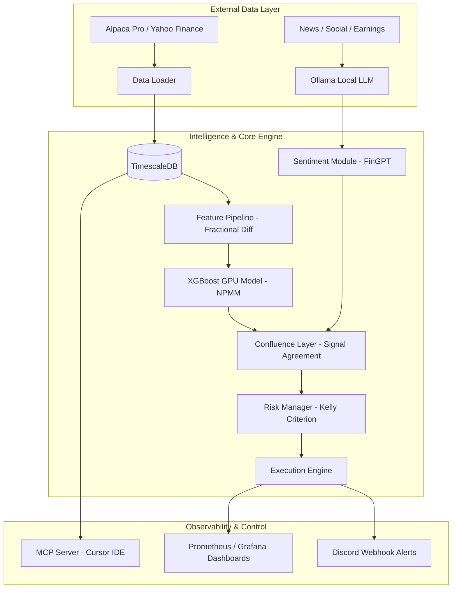

# Nova Aetus: Institutional Trading System Architecture

This document contains the complete system schematic and architectural diagrams for the Nova Aetus Swing Trading System.

## 1. System Integration Schematic

---

## 2. Component Directory

### I. The Data Foundation
*   **DataLoader (`src/nova/data/loader.py`)**: Async fetcher integrated with Alpaca Pro. Feeds raw OHLCV data.
*   **StorageService (`src/nova/data/storage.py`)**: Manages TimescaleDB. Implements Continuous Aggregates (1m, 1h, 1d) and 90x Hypercore compression.

### II. Alpha Generation
*   **TechnicalFeatures (`src/nova/features/technical.py`)**: Computing 88+ metrics. Uses Fractional Differentiation to maintain stationarity without losing price memory.
*   **SentimentAnalyzer (`src/nova/features/sentiment.py`)**: Uses Ollama (Llama-3/Mistral) with financial domain-specific prompts to extract signals from unstructured text.

### III. Machine Learning & Validation
*   **ModelTrainer (`src/nova/models/trainer.py`)**: GPU-accelerated XGBoost core. Uses NPMM (N-Period Min-Max) labeling for high-confidence swing points.
*   **BacktestValidator (`src/nova/models/validation.py`)**: Statistically audits strategies using Deflated Sharpe Ratio (DSR) and Probability of Backtest Overfitting (PBO).

### IV. Risk & Execution
*   **ConfluenceLayer (`src/nova/strategy/confluence.py`)**: Orchestrates agreement between factors. Weights signals based on detected Market Regimes.
*   **RiskManager (`src/nova/strategy/risk.py`)**: Guardian of capital. Uses Fractional Kelly Criterion for sizing and a 3-Level circuit breaker.

---

## 3. Communication & Observability
*   **Notifications (`src/nova/core/notifications.py`)**: Real-time alerts to the Discord Webhook.
*   **Metrics (`src/nova/core/metrics.py`)**: Prometheus instrumentation for SRE Golden Signals (Latency, Traffic, Errors, Saturation).
*   **IDE Bridge (`mcp_server/db_connector.py`)**: Allows direct natural-language querying of the database via Cursor Chat.
